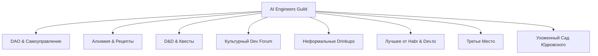

# 🔮 Видение и Манифест AI Engineers Guild

Добро пожаловать в **AI Engineers Guild** — живую экосистему, созданную инженерами для инженеров. Это не просто чат и не очередная новостная лента. Это попытка переосмыслить то, как специалисты в эпоху ИИ общаются, делятся знаниями и создают новое.

---

## 🧪 ДНК Нашего Сообщества: Смесь Лучших Концепций

Мы строим пространство на стыке восьми фундаментальных идей, каждая из которых привносит свой уникальный элемент в общую структуру:

### 1. 🏛 DAO (Децентрализация и меритократия)
Сообщество является самоуправляемым. Здесь нет слепого авторитаризма. Правила (`main_rules.md`) и дорожная карта (`backlog.md`) лежат в открытом репозитории. Любой участник может предложить изменение через Pull Request. Твой ранг и влияние определяются реальным вкладом (Proof of Work), а не красивыми должностями.

### 2. 🧙‍♂️ Алхимическая гильдия (Рецепты и трансмутация)
Раньше алхимики скрывали свои формулы, но мы строим гильдию нового типа. Мы делимся рабочими «заклинаниями» (промптами), «рецептами зелий» (конфигурациями системных инструкций вроде `agents.md`) и «инструментами трансмутации» (кастомными MCP-серверами и скиллами). Мы обмениваемся опытом превращения сырого контекста в работающий код и продукты.

### 3. 🎲 Dungeons & Dragons (Игровая механика и роли)
We перекладываем рутину на игровые рельсы. В гильдии есть четкие роли: **Гильдмастер** (инфраструктура), **ИИ-Авторы** (создатели ценности), **Ремесленники** (те, кто учится и строит). Совместные проекты оформляются как «кампейны» (групповые походы), а сложные задачи из бэклога — как «баунти-квесты» с реальной наградой.

### 4. 💻 Форумы разработчиков нулевых (Инженерная глубина)
Мы возвращаем вайб старых технических форумов, где люди закапывались в байты, конфиги и архитектуру. Но мы убираем их главный минус — toxic снобизм. У нас действует жесткое осуждение душного элитаризма. Помоги коротко или пройди мимо, никакого надменного «погугли за меня».

### 5. 🍻 Дринкапы и кухонные разговоры (Человеческий вайб)
Лучшие идеи рождаются не на официальных конференциях, а за барной стойкой, чашкой кофе или кальяном. Мы ценим неформальное общение, доброжелательный рофл и честные разговоры без цензуры и корпоративного буллшита.

### 6. 📝 Лучшее от Habr & Dev.to (Технические логи без кликбейта)
Мы устали от SEO-ферм, рекламного лидгена и сотых репостов новости «GPT-5 порвала бенчмарки». Наш стандарт контента — это глубокие разборы личных кейсов, результаты реальных бенчмарков (например, бенчмарк контекста ИИ-инструментов) и честный опыт ошибок.

### 7. ☕ Концепция «Третьего места» (Социальный якорь)
По Рэю Ольденбургу, у человека должно быть три места: первое — дом, второе — работа, а третье — нейтральное пространство для души, где нет обязанностей, царит равенство и куда всегда приятно вернуться. Guild — это наше цифровое (а иногда и физическое) Третье место.

### 8. 🏡 Ухоженный сад Элизера Юдковского (Защита от энтропии)
> *«Хороший чат — это сад, который легко загубить халатностью...»*

Как писал Элизер Юдковски, здоровое интеллектуальное пространство требует постоянного и бережного ухода (активной прополки сорняков). Без модерации любое комьюнити скатывается в шум, спам и агрессию. Мы безжалостно удаляем политические споры, агрессивную рекламу и пустой новостной спам, чтобы сохранить почву для содержательного диалога.

---

## 🌐 Концепция Макро-Сообщества и принципы ODS

Мы не пытаемся конкурировать с существующими группами, каналами или локальными чатами. AI Engineers Guild строится как **Макро-Сообщество** (подобно Open Data Science — ODS), опираясь на фундаментальные принципы ODS:

* **Принцип зонтичности (Umbrella Platform):** Мы поддерживаем любые существующие или новые комьюнити, проекты и нишевые каналы. Мы не перетягиваем аудиторию, а даем им общую инфраструктуру, репозитории, инструменты монетизации и площадку для обмена опытом.
* **Принцип открытости и меритократии (Openness & Meritocracy):** Двери гильдии открыты для всех, а статус и признание зарабатываются реальным вкладом (Proof of Work), а не былыми заслугами или должностями.
* **Горизонтальные связи (Horizontal Connections):** Мы поощряем прямое общение инженеров без посредников, менеджеров и корпоративных барьеров.
* **Кооперация вместо конкуренции:** Мы приветствуем совместные коллаборации с любыми внешними ИИ-сообществами и группами, предоставляя наши ресурсы как общую платформу для роста.

---

## ⛰ Офлайн-ядро: Алматы, Казахстан

Мы глубоко убеждены, что цифровое общение не должно полностью заменять физический контакт. Напротив, в эпоху тотальной виртуализации реальные встречи приобретают огромную ценность.

На данный момент географическое и энергетическое ядро Гильдии находится в **Алматы, Казахстане**.

* **Горы вместо психотерапии:** Наша визитная карточка — спонтанные хайкинги и походы по Заилийскому Алатау. Мы верим, что прогулка по горным тропам с обсуждением агентных архитектур освежает разум лучше любых созвонов.
* **Физические встречи:** Локальные митапы, совместный кодинг в коворкингах и уютные дринкапы — неотъемлемая часть жизни гильдии. Если вы оказались в Алматы, просто напишите в чат — здесь всегда найдется компания для восхождения на пик или вечернего обсуждения системных промптов.

---

> [!NOTE]
> AI Engineers Guild — это живой эксперимент. Мы не знаем, куда приведет нас эта дорога, но мы уверены, что идти по ней в компании близких по духу инженеров гораздо интереснее. Присоединяйтесь к созданию ухоженного сада будущего!
> 
> 💬 **Наш Telegram-канал:** [t.me/ai_engineers_guild](https://t.me/ai_engineers_guild)
